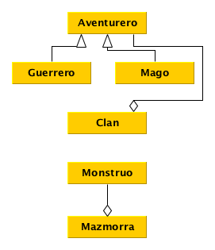
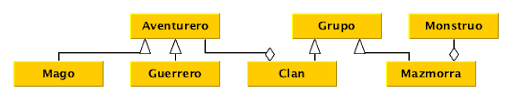

# Pauta Control 2 IIC2233 - Programación Avanzada

## 1. Verdadero y Falso (1,5 puntos)

**Distribución de puntaje:**
  - 0,15 por respuesta correcta (V o F)
  - 0,20 por justificar correctamente en caso de las falsas: 0,1 puntos para
  las justificaciones incompletas

1. **(V)** Una función `g`, definida dentro de otra función `f`, tiene acceso de
lectura a las variables definidas en `f`.

2. **(V)** En OOP, el concepto de ”interfaz” se refiere al conjunto de atributos
y métodos que expone un objeto.

3. **(F)** En Python, los atributos que empiezan con exactamente un `_` son privados;
por lo tanto, no pueden ser accedidos desde afuera de la clase que los declara.
    - **R:** El _underscore_ inicial se trata solamente de una convención para señalar
    que ese método o atributo no es parte de la interfaz del objeto. Sin embargo, es
    perfectamente posible acceder a este valor fuera de la clase, ya que en Python
    no existen los atributos o métodos privados.

4. **(V)** Dentro de un objeto, un _property_ funciona como si fuera un atributo.

5. **(F)** Si miembros es un _property_ de la instancia `clan1`, entonces `clan1.miembros.append(aventurero1)` llama al _setter_.
    - **R:** Se llama solo al getter. Lo que hace este llamado es mutar el valor que
    entrega el getter.

6. **(F)** El _overriding_ es una forma de polimorfismo que no ocupa herencia.
    - **R:** El _overriding_ se trata de, precisamente, sobreescribir métodos
    implementados en la clase madre. Por lo tanto, sí ocupa herencia.

## 2. Desarrollo rápido (1,0 punto)

Habían 3 formas para esta parte.

**Forma 1**

``` Python
@agregar(42)
@filtrar
def promedio(iterable):
  num, den = (sum(x) for x in zip(*map(lambda x: (x, 1), iterable)))
  return num / den
```

**Forma 2**

``` Python
@agregar
@filtrar(42)
def promedio(iterable):
  num, den = (sum(x) for x in zip(*map(lambda x: (x, 1), iterable)))
  return num / den
```

**Forma 3**

``` Python
@filtrar(42)
@agregar
def promedio(iterable):
  num, den = (sum(x) for x in zip(*map(lambda x: (x, 1), iterable)))
  return num / den
```

Reescriba la función promedio ---como aparece en el código--- sin utilizar el
azúcar sintáctico. En otras palabras, asuma que promedio ya está definido
(sin decorar), y emule la funcionalidad agregada en las líneas 1 y 2
(de los decoradores).

**Distribución de puntaje:**
  - 0,0 puntos desarrollo incorrecto o en blanco
  - 0,2 puntos desarrollo con algún error grave
  - 0,8 puntos desarrollo con algún error leve
  - 1,0 puntos desarrollo correcto

**Respuestas:**

- **Forma 1:**
    ``` python
    promedio = agregar(42)(filtrar(promedio))
    ```
- **Forma 2:**
    ```python
    promedio = agregar(filtrar(42)(promedio))
    ```
- **Forma 3:**
    ```python
    promedio = filtrar(42)(agregar(promedio))
    ```

## 3. Sobre la actividad (1,5 puntos)

En esta parte deberá crear un diagrama tipo UML para las clases pedidas en la
actividad de hoy. **No es necesario incluir los atributos ni métodos** en este
diagrama, solo las clases y la relación entre ellas.

Las clases pedidas son: **Aventurero**, **Guerrero**, **Mago**, **Monstruo**,
**Clan**, y **Mazmorra**.

Soluciones propuestas:




**Distribución de puntaje:**
  - **(0,4)** Mago y Guerrero **heredan** de Aventurero.  Además, Mago, Guerrero
  y  Aventurero no tienen otra relación directa entre ellas.
  - **(0,3)** Monstruo **no tiene relación directa** con Aventurero, Mago ni Guerrero.
  - **(0,3)** Clan está relacionado con Aventurero **solamente con composición o
  agregación.**
    - Si la relación está hecha directamente con Mago y Guerrero (y no Aventurero),
    asignar 0,3 en vez de 0,4.
    - En caso de que haya hecho la relación con las tres clases, solo acotar que era innecesario.
  - **(0,1)** Clan **no tiene relación** con Monstruo.
  - **(0,3)** Mazmorra está relacionada con Monstruo **solamente mediante composición o agregación.**
  - **(0,1)** Clan y Mazmorra **no tienen relación directa.**

## 4. Lectura de código (2,0 puntos)

**Forma 1**

```Python
def accion(param):
  def decorator(f):
    def inner(*x, **y):
      return f'{param}{f(*x, **y)}'
    return inner
  return decorator

class A:

  def __init__(self, a, b):
    self.a = a
    self.b = b

  @property
  def b(self):
    return self._b * 2

  @b.setter
  def b(self, valor):
    self._b = valor

  def metodo(self):
    return self._a * self._b

class B(A):

  def __init__(self, a, b, c):
    super().__init__(a, b)
    self._c = c

  @accion('el resultado es:')
  def metodo(self):
    return self._a * self._b + self._c

x = A(3, 2)
y = B(3, 2, 33)
y.b = 3
print(x.b)
print(y.b)
print(x.metodo())
print(y.metodo())
```

**Forma 2:** _getter_ de b multiplica por 3 en vez de 2.

```Python
def accion(param):
  def decorator(f):
    def inner(*x, **y):
      return f'{param}{f(*x, **y)}'
    return inner
  return decorator

class A:

  def __init__(self, a, b):
    self.a = a
    self.b = b

  @property
  def b(self):
    return self._b * 3

  @b.setter
  def b(self, valor):
    self._b = valor

  def metodo(self):
    return self._a * self._b

class B(A):

  def __init__(self, a, b, c):
    super().__init__(a, b)
    self._c = c

  @accion('el resultado es:')
  def metodo(self):
    return self._a * self._b + self._c

x = A(3, 2)
y = B(3, 2, 33)
y.b = 3
print(x.b)
print(y.b)
print(x.metodo())
print(y.metodo())
```

**Forma 3:**  método `metodo` hace algo distinto, y los parámetros con que se
inicializan las instancias son distintos.

```Python
def accion(param):
  def decorator(f):
    def inner(*x, **y):
      return f'{param}{f(*x, **y)}'
    return inner
  return decorator

class A:

  def __init__(self, a, b):
    self.a = a
    self.b = b

  @property
  def b(self):
    return self._b * 2

  @b.setter
  def b(self, valor):
    self._b = valor

  def metodo(self):
    return self._a + self._b

class B(A):

  def __init__(self, a, b, c):
    super().__init__(a, b)
    self._c = c

  @accion('el resultado es:')
  def metodo(self):
    return (self._a + self._b) * self._c

x = A(3, 2)
y = B(30, 2, 2)
y.b = 3
print(x.b)
print(y.b)
print(x.metodo())
print(y.metodo())
```

1. **(0,5 puntos)** ¿Qué relación tienen las clases `A` y `B`? Explique brevemente
qué hace esta relación en general.

- 0,25 (binario) por decir que la relación es alguna de estas o similar:
    - “Herencia”
    - B es subclase de A
    - A es superclase de B
    - B es una especialización de A
    - A es la clase madre de B
    - B es una clase hija de A
- 0,25 (binario) por explicar qué es lo que hace la herencia. Algunas respuestas aceptadas:
    - Permite hacer clases especializadas a partir de una clase base.
    - Permite mantener atributos y métodos de una clase base, pudiendo agregar o modificar algunos aspectos.
    - Permite reutilizar la implementación de una clase base.

2. **(1,5 puntos)** Indique el output del código (depende de la forma).

**Forma 1:**

| Output | Punto | Comentario |
|:------:|:-----:|:----------:|
| 4	     | (0,3) | Correcto o incorrecto|
| 6	     | (0,3) | Correcto o incorrecto|
| 12     | (0,3) | 3 * línea 1 |
|El resultado es: 51 |	(0,3) | 3 * línea 2 + 33
|          |	(0,3) | decorador correcto, y solo en la última línea.|

**Forma 2:**

| Output | Puntaje | Comentario |
|:------:|:-------:|:----------:|
| 6      | (0,3)   | Correcto o incorrecto |
| 9      | (0,3)   | Correcto o incorrecto |
| 18	 | (0,3)   | 3 * línea 1 |
| El resultado es: 60 |	(0,3) | (3 * línea 2) + 33 |
|		| (0,3) | decorador correcto, y solo en la última línea. |

**Forma 3:**

| Output | Puntaje | Comentario |
|:------:|:-------:|:----------:|
| 4 | (0,3) | Correcto o incorrecto|
| 6 | (0,3) | Correcto o incorrecto|
| 7 | (0,3) | 3 + línea 1 |
| El resultado es: 72 |	(0,3) | (30 + línea 2) * 2
|      | (0,3) | decorador correcto, y solo en la última línea.
